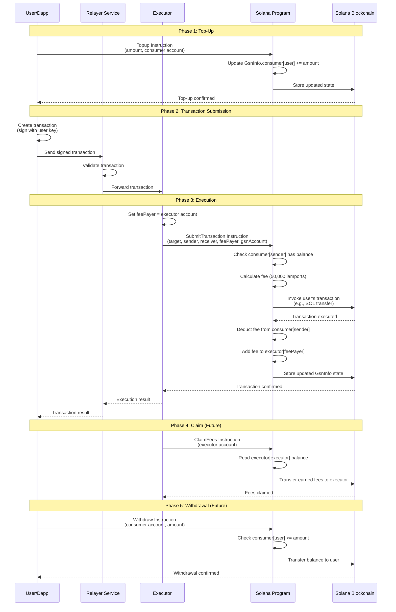

# SolGSN: Solana Gas Station ⛽

It is an Gas Station implementation for Solana blockchain. The smart contract program is written in Rust programming language.<br/>
This platform/network will allow users to do gas-less transactions. This network will allow Dapps on Solana to pay the gas fee of their users. A single user can also use this network.
Using this platform, One can pay transaction fee in other solana supported token as well. For eg. One can top-up account using USDC token instead of SOL.

<br/>

- A relayer will be used to publish the signed transaction and, the executor on relayer will pay the fee. The execution and fee deduction will be done through smart contract only. The consumer/user will first top-up their account using SOL or any SLP token. On a successful transaction execution, the fee will get deducted from top-up credit and get added to the executor (fee-payer).
- The executor can claim their earned fee anytime directly from the smart contract. We will include governance in future for changing fees etc.
- Also, the Dapp & User can withdraw their topup anytime if they want. The topup credit will be associated with account. The amount will be stored in the program account or smart contract.

**Note**: This project is developed during [_Solana Wormhole Hackathon_](https://solana.com/hackathon) in 15 days. It's a basic version of whole idea. Please have a look at [**Pitch Deck :notebook_with_decorative_cover:**](https://docs.google.com/presentation/d/14iBbXitBhS5vqem0ZE_9nsbn1lXT0uF9vwPMs_1PnJM/edit?usp=sharing) submitted for the hackathon.

# Running Project Locally

1. Prerequisites: Make sure you've installed [Node.js] and [Rust with correct target][rust]. You will also need `solana` installed.
2. Install dependencies: `npm install`
3. Start Solana on Localner: `sudo npm run localnet:up`
4. Build SolGSN program: `npm run build`
5. Execute program: `npm run start`

You will see output something like this:<br/><br/>


# User Flow

The SolGSN system enables gasless transactions through a complete lifecycle from top-up to withdrawal:

## 1. Top-Up

Users or Dapps must first deposit funds into their GSN account to enable gasless transactions.

**Process:**
- User/Dapp calls the `Topup` instruction with an amount
- The program stores the top-up balance in the `GsnInfo` state account
- Balance is associated with the consumer's public key
- Multiple top-ups accumulate (amounts are added to existing balance)

**Client Function:**
```javascript
await topup(connection, gsnAccount, consumerAccount, amount, payerAccount);
```

**Required Accounts:**
- `gsnAccount`: The GSN program state account (writable)
- `consumerAccount`: The user/dapp account to top up (readable)
- `payerAccount`: Account paying for the transaction fees (signer)

## 2. Relayer Signing

The relayer receives signed transactions from users and prepares them for execution.

**Process:**
- User creates and signs their transaction (without paying fees)
- User sends the signed transaction to a relayer service
- Relayer validates the transaction and forwards it to an executor
- The transaction includes the user's signature but sets the executor as `feePayer`

**Note:** The relayer is an off-chain service that acts as an intermediary between users and executors. It doesn't need to sign transactions itself but coordinates the flow.

## 3. Executor Paying Fees

The executor pays the transaction fees upfront and gets reimbursed from the user's top-up balance.

**Process:**
- Executor receives the transaction from the relayer
- Executor sets themselves as `feePayer` in the transaction
- Executor calls `SubmitTransaction` instruction with the transaction
- Program validates the user has sufficient top-up balance
- Program executes the user's transaction (e.g., SOL transfer)
- Program deducts the fee (currently 50,000 lamports) from user's top-up balance
- Program credits the fee to executor's earned balance

**Client Function:**
```javascript
await submitTx(
  connection,
  targetProgram,
  senderAccount,
  receiverAccount,
  feePayerAccount,
  gsnAccount,
  amount,
  programId
);
```

**Required Accounts:**
- `targetProgram`: The program being invoked (e.g., System Program for transfers)
- `senderAccount`: User's account (signer, writable)
- `receiverAccount`: Recipient account (writable)
- `feePayerAccount`: Executor's account (signer, writable)
- `gsnAccount`: GSN program state account (writable)

## 4. Fee Refund/Claim

Executors accumulate fees in their earned balance and can claim them.

**Process:**
- Executor's earned fees are tracked in the `executor` map in `GsnInfo`
- Each successful transaction adds fees to the executor's balance
- Executor can claim their accumulated fees (implementation pending)
- Claim transfers the earned amount from the program account to executor's wallet

**Note:** The claim functionality is planned but not yet implemented in the current version.

## 5. Withdrawal

Users can withdraw their remaining top-up balance at any time.

**Process:**
- User requests withdrawal of their top-up balance
- Program verifies the user has a balance in the `consumer` map
- Program transfers the balance back to the user's account
- User's entry in the `consumer` map is updated or removed

**Note:** The withdrawal functionality is planned but not yet implemented in the current version.

---

# Sequence Diagram

The following sequence diagram illustrates the interaction between Dapp, Relayer, Executor, and the Solana Program for a single gasless transaction:



---

# Dapp Integration Guide

This section explains how to integrate SolGSN into your Dapp to enable gasless transactions for your users.

## Client Functions

The SolGSN client provides the following functions in `/src/client/index.js`:

### `establishConnection()`
Establishes connection to the Solana cluster.

```javascript
import { establishConnection } from './client/index';

await establishConnection();
// Connection established to cluster
```

### `establishPayer()`
Creates or retrieves the payer account for deployment and setup transactions.

```javascript
import { establishPayer } from './client/index';

await establishPayer();
// Payer account ready
```

### `loadProgram()`
Loads the SolGSN program to the blockchain if not already deployed.

```javascript
import { loadProgram } from './client/index';

await loadProgram();
// Program loaded or already exists
```

### `initialize()`
Initializes the GSN program state account. Must be called once before any other operations.

```javascript
import { initialize } from './client/index';

await initialize();
// GSN program initialized
```

**Required Accounts:**
- `payerAccount`: Account to pay for account creation and initialization (signer)

**Expected Errors:**
- `ProgramError::InvalidAccountData`: If the account is already initialized incorrectly
- Transaction fails if account creation fails (insufficient funds)

### `topup(connection, gsnAccount, consumerAccount, amount, payerAccount)`
Adds balance to a consumer's GSN account.

```javascript
import { topup } from './client/index';

const amount = new u64(10000000); // 0.01 SOL in lamports
await topup(connection, gsnAccount, consumerAccount, amount, payerAccount);
```

**Required Accounts:**
- `gsnAccount`: The GSN program state account (writable, must be initialized)
- `consumerAccount`: The user/dapp account to top up (readable)
- `payerAccount`: Account paying for the transaction (signer)

**Instruction Data:**
- `instruction`: `1` (Topup instruction)
- `amount`: `u64` - Amount in lamports to add to balance

**Expected Errors:**
- `ProgramError::InvalidAccountData`: If GSN account is not initialized
- `ProgramError::AccountDataTooSmall`: If account data buffer is too small
- Transaction fails if payer has insufficient funds

### `submitTx(connection, targetProgram, senderAccount, receiverAccount, feePayerAccount, gsnAccount, amount, programId)`
Submits a gasless transaction where the executor pays fees.

```javascript
import { submitTx } from './client/index';

const amount = new u64(1000000000); // 1 SOL in lamports
await submitTx(
  connection,
  targetProgram,      // e.g., System Program
  senderAccount,      // User's account (must have top-up balance)
  receiverAccount,    // Recipient account
  feePayerAccount,    // Executor's account
  gsnAccount,        // GSN program state account
  amount,
  programId
);
```

**Required Accounts (in order):**
1. `targetProgram`: The program to invoke (e.g., System Program for transfers) - writable
2. `senderAccount`: User's account - signer, writable
3. `receiverAccount`: Recipient account - writable
4. `feePayerAccount`: Executor's account - signer, writable
5. `gsnAccount`: GSN program state account - writable

**Instruction Data:**
- `instruction`: `2` (SubmitTransaction instruction)
- `amount`: `u64` - Amount to transfer (for transfer transactions)

**Transaction Setup:**
- The transaction must set `feePayer` to the executor's account
- The sender account must sign the transaction
- The fee payer account must sign the transaction

**Expected Errors:**
- `ProgramError::InvalidInstructionData`: If sender doesn't have a top-up balance
- `ProgramError::InvalidAccountData`: If GSN account is not initialized
- Transaction fails if sender's top-up balance is insufficient for fees
- Transaction fails if the invoked program instruction fails

## Integration Steps

1. **Initialize GSN Program** (one-time setup):
   ```javascript
   await establishConnection();
   await establishPayer();
   await loadProgram();
   await initialize();
   ```

2. **Top-Up User Account**:
   ```javascript
   // User or Dapp tops up their account
   await topup(connection, gsnAccount, userAccount, amount, payerAccount);
   ```

3. **Create Gasless Transaction**:
   ```javascript
   // User creates their transaction
   const transaction = new Transaction({
     feePayer: executorAccount.publicKey, // Executor pays fees
   });
   
   // Add user's instruction
   transaction.add(userInstruction);
   
   // User signs
   transaction.sign(userAccount);
   ```

4. **Submit via Relayer/Executor**:
   ```javascript
   // Executor receives transaction, signs, and submits
   transaction.sign(executorAccount);
   await submitTx(/* ... */);
   ```

## Error Handling

Always handle the following error cases:

- **Insufficient Top-Up Balance**: Check user's balance before submitting transactions
- **Account Not Initialized**: Ensure GSN program is initialized before use
- **Transaction Failures**: Handle program instruction failures gracefully
- **Network Issues**: Implement retry logic for network-related failures

---

# Relayer/Executor Configuration

This section explains how relayers and executors are configured and operate in the SolGSN network.

## Architecture Overview

The SolGSN network consists of two off-chain components:

1. **Relayer**: Receives signed transactions from users and forwards them to executors
2. **Executor**: Pays transaction fees and submits transactions to the Solana program

## Relayer Setup

A relayer is an off-chain service that acts as an intermediary between users and executors.

### Responsibilities

- Receive signed transactions from users/Dapps
- Validate transaction signatures and structure
- Forward valid transactions to available executors
- Monitor transaction status and relay results back to users
- Optionally filter or prioritize transactions

### Configuration

A relayer service should:

1. **Connect to Solana Network**:
   ```javascript
   const connection = new Connection(clusterUrl, 'confirmed');
   ```

2. **Monitor for Transactions**:
   - Accept transactions via HTTP API, WebSocket, or message queue
   - Validate user signatures
   - Check user has sufficient top-up balance (query GSN state)

3. **Forward to Executors**:
   - Maintain a list of available executors
   - Distribute transactions across executors (load balancing)
   - Handle executor failures and retries

### Example Relayer Service Structure

```javascript
// Relayer service (pseudo-code)
class RelayerService {
  constructor(connection, gsnAccount, executors) {
    this.connection = connection;
    this.gsnAccount = gsnAccount;
    this.executors = executors; // List of executor endpoints
  }

  async receiveTransaction(signedTransaction) {
    // Validate transaction
    const isValid = await this.validateTransaction(signedTransaction);
    if (!isValid) throw new Error('Invalid transaction');

    // Check user has balance
    const hasBalance = await this.checkUserBalance(signedTransaction);
    if (!hasBalance) throw new Error('Insufficient balance');

    // Forward to executor
    const executor = this.selectExecutor();
    return await executor.submitTransaction(signedTransaction);
  }

  async checkUserBalance(transaction) {
    // Query GSN state account to check user's top-up balance
    const gsnInfo = await this.getGsnState();
    const userPubkey = transaction.signerKey;
    const balance = gsnInfo.consumer.get(userPubkey);
    return balance >= MINIMUM_BALANCE;
  }
}
```

## Executor Setup

An executor is an off-chain service that pays transaction fees and submits transactions to the Solana program.

### Responsibilities

- Receive transactions from relayers
- Set itself as `feePayer` in transactions
- Sign and submit transactions to Solana
- Accumulate earned fees in the GSN program
- Monitor transaction confirmation
- Claim accumulated fees periodically

### Configuration

An executor service should:

1. **Maintain Executor Account**:
   ```javascript
   // Executor needs a funded account to pay fees
   const executorAccount = new Account();
   // Fund the account with SOL for transaction fees
   ```

2. **Connect to Solana Network**:
   ```javascript
   const connection = new Connection(clusterUrl, 'confirmed');
   ```

3. **Process Transactions**:
   ```javascript
   async function executeTransaction(transaction, gsnAccount, programId) {
     // Set executor as fee payer
     transaction.feePayer = executorAccount.publicKey;
     
     // Sign with executor key
     transaction.sign(executorAccount);
     
     // Submit to GSN program
     await submitTx(
       connection,
       targetProgram,
       senderAccount,
       receiverAccount,
       executorAccount,
       gsnAccount,
       amount,
       programId
     );
   }
   ```

4. **Monitor Earned Fees**:
   ```javascript
   async function getEarnedFees(executorPubkey) {
     const gsnInfo = await getGsnState();
     return gsnInfo.executor.get(executorPubkey) || 0;
   }
   ```

5. **Claim Fees** (when implemented):
   ```javascript
   // Future: Claim accumulated fees
   await claimFees(executorAccount, gsnAccount);
   ```

### Executor Requirements

- **Funded Account**: Executor must maintain sufficient SOL balance to pay transaction fees
- **Network Access**: Reliable connection to Solana cluster
- **Monitoring**: Track transaction success/failure rates
- **Fee Management**: Monitor earned fees and claim periodically

### Running an Executor

1. **Deploy Executor Service**:
   - Set up Node.js service or similar
   - Configure Solana connection (cluster URL, commitment level)
   - Load executor account keypair securely

2. **Connect to Relayer**:
   - Register executor endpoint with relayer
   - Implement transaction receiving endpoint
   - Handle transaction processing queue

3. **Monitor and Maintain**:
   - Monitor transaction success rates
   - Track earned fees in GSN state
   - Maintain executor account balance
   - Claim fees when threshold is reached

### Example Executor Service Structure

```javascript
// Executor service (pseudo-code)
class ExecutorService {
  constructor(connection, executorAccount, gsnAccount, programId) {
    this.connection = connection;
    this.executorAccount = executorAccount;
    this.gsnAccount = gsnAccount;
    this.programId = programId;
  }

  async processTransaction(transaction) {
    try {
      // Set executor as fee payer
      transaction.feePayer = this.executorAccount.publicKey;
      transaction.sign(this.executorAccount);

      // Submit via GSN program
      const signature = await this.submitToGsn(transaction);
      
      // Monitor confirmation
      await this.connection.confirmTransaction(signature);
      
      return { success: true, signature };
    } catch (error) {
      return { success: false, error: error.message };
    }
  }

  async submitToGsn(transaction) {
    // Extract accounts and data from transaction
    // Call submitTx instruction
    // ...
  }

  async claimFees() {
    // Future: Claim accumulated fees from GSN program
    // const earnedFees = await this.getEarnedFees();
    // await claimFeesInstruction(/* ... */);
  }
}
```

## Network Topology

```
User/Dapp → Relayer → Executor → Solana Program → Blockchain
                ↓         ↓
            Validation  Fee Payment
```

- **Users/Dapps**: Create and sign transactions, send to relayers
- **Relayers**: Validate and route transactions to executors
- **Executors**: Pay fees and submit transactions
- **Solana Program**: Manages top-up balances and fee accounting

---

# Program Account Data Structure

This section explains the data stored in the GSN program accounts and how clients can access and index this information.

## GSN State Account Structure

The main GSN program state is stored in a single account (`GsnInfo`). This account is created during initialization and stores all top-up balances and executor earnings.

### Data Structure

The `GsnInfo` struct (defined in `src/program-rust/src/state.rs`) contains:

```rust
pub struct GsnInfo {
    pub is_initialized: bool,                    // 1 byte
    pub consumer: BTreeMap<String, u64>,         // Variable size
    pub executor: BTreeMap<String, u64>,         // Variable size
}
```

**Fields:**

1. **`is_initialized`** (`bool`, 1 byte)
   - Indicates whether the GSN program has been initialized
   - Set to `true` during initialization
   - Used to prevent re-initialization

2. **`consumer`** (`BTreeMap<String, u64>`)
   - Maps consumer public keys (as strings) to their top-up balances (in lamports)
   - Key: Consumer's public key as base58 string
   - Value: Top-up balance in lamports
   - Updated on: Top-up (adds to balance), SubmitTransaction (deducts fees)

3. **`executor`** (`BTreeMap<String, u64>`)
   - Maps executor public keys (as strings) to their earned fees (in lamports)
   - Key: Executor's public key as base58 string
   - Value: Accumulated earned fees in lamports
   - Updated on: SubmitTransaction (adds fees after successful execution)

### Serialization

The data is serialized using Borsh (Binary Object Representation Serializer for Hashing):

- Borsh provides deterministic serialization
- Data is stored in the account's `data` field
- Account must have sufficient space (currently 1024 bytes in initialization)

## Finding the GSN Account

The GSN state account is created during initialization. To find it:

1. **From Client Code**: The account is stored after initialization:
   ```javascript
   const gsnAccount = new Account();
   // ... create and initialize account
   // gsnAccount.publicKey is the GSN state account address
   ```

2. **From Program ID**: The GSN state account is a Program Derived Address (PDA) or a regular account owned by the program. The client code creates it explicitly.

3. **Persistence**: The account address should be stored in your Dapp's configuration or retrieved from a known registry.

## Reading Account Data

### Using Solana Web3.js

```javascript
import { Connection, PublicKey } from '@solana/web3.js';
import { deserialize } from './util/borsh';

async function getGsnState(connection, gsnAccountPubkey) {
  // Fetch account info
  const accountInfo = await connection.getAccountInfo(gsnAccountPubkey);
  
  if (!accountInfo) {
    throw new Error('GSN account not found');
  }

  // Deserialize using Borsh
  const schema = {
    is_initialized: 'bool',
    consumer: 'map',  // BTreeMap serialization
    executor: 'map', // BTreeMap serialization
  };

  const gsnInfo = deserialize(schema, accountInfo.data);
  return gsnInfo;
}
```

### Reading Consumer Balance

```javascript
async function getConsumerBalance(connection, gsnAccountPubkey, consumerPubkey) {
  const gsnInfo = await getGsnState(connection, gsnAccountPubkey);
  const balance = gsnInfo.consumer.get(consumerPubkey.toBase58()) || 0;
  return balance;
}
```

### Reading Executor Earnings

```javascript
async function getExecutorEarnings(connection, gsnAccountPubkey, executorPubkey) {
  const gsnInfo = await getGsnState(connection, gsnAccountPubkey);
  const earnings = gsnInfo.executor.get(executorPubkey.toBase58()) || 0;
  return earnings;
}
```

## Indexing Account Data

Since the GSN state uses `BTreeMap`, you can:

1. **Direct Lookup**: Query the account and deserialize to get all data
2. **Event Monitoring**: Monitor transactions to the GSN program to track changes
3. **Periodic Polling**: Poll the account state at regular intervals

### Example: Monitor All Consumers

```javascript
async function getAllConsumers(connection, gsnAccountPubkey) {
  const gsnInfo = await getGsnState(connection, gsnAccountPubkey);
  const consumers = [];
  
  for (const [pubkey, balance] of gsnInfo.consumer.entries()) {
    consumers.push({
      pubkey: new PublicKey(pubkey),
      balance: balance,
    });
  }
  
  return consumers;
}
```

### Example: Monitor All Executors

```javascript
async function getAllExecutors(connection, gsnAccountPubkey) {
  const gsnInfo = await getGsnState(connection, gsnAccountPubkey);
  const executors = [];
  
  for (const [pubkey, earnings] of gsnInfo.executor.entries()) {
    executors.push({
      pubkey: new PublicKey(pubkey),
      earnings: earnings,
    });
  }
  
  return executors;
}
```

## Account Size Considerations

- **Initial Size**: 1024 bytes (set during account creation)
- **Dynamic Growth**: `BTreeMap` grows as more consumers/executors are added
- **Limitations**: Account size is fixed; if it fills up, a new account or migration strategy is needed
- **Rent**: Account must maintain minimum rent-exempt balance

## Transaction History

To track changes over time:

1. **Monitor Transactions**: Listen for transactions involving the GSN account
2. **Parse Instructions**: Extract Topup and SubmitTransaction instructions
3. **Build Index**: Maintain an off-chain index of balances and earnings

### Example: Transaction Monitoring

```javascript
async function monitorGsnAccount(connection, gsnAccountPubkey) {
  connection.onProgramAccountChange(
    gsnAccountPubkey,
    (accountInfo) => {
      const gsnInfo = deserializeGsnState(accountInfo.data);
      // Update local index
      updateLocalIndex(gsnInfo);
    },
    'confirmed'
  );
}
```

## Best Practices

1. **Cache State**: Cache the GSN state to reduce RPC calls
2. **Error Handling**: Handle cases where account doesn't exist or isn't initialized
3. **Validation**: Verify `is_initialized` before reading consumer/executor data
4. **Efficiency**: Use `getMultipleAccounts` if querying multiple accounts
5. **Monitoring**: Set up monitoring for account changes to keep indexes up-to-date

---

# Exploring The Code

1. The "program" (smart contract) code lives in the `/src/program-rust` folder. This code gets deployed to
   the Solana blockchain when you run `npm run build`. This sort of
   code-that-runs-on-a-blockchain is called a "program". The best file to start with the program is `lib.rs`.

2. The client code for loading & testing lives in the `/src/client` folder. `/src/main.js` is a great
   place to start exploring. Note that it loads in `/src/index.js`, where you
   can see all the program function getting executed synchronusly.
